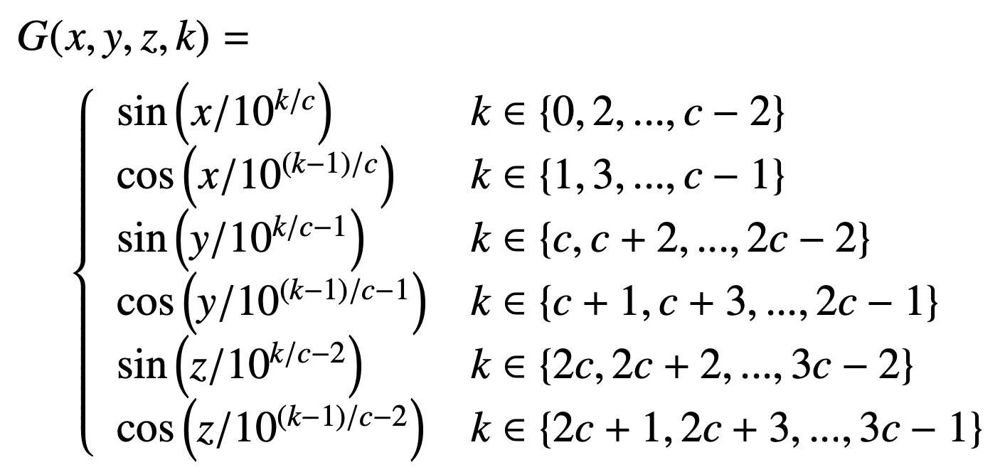

# Mouse Brain Extractor #


Mouse Brain Extractor is a deep-learning-based method for segmenting the brain from mouse T2- and T1-weighted MRI data. Our method builds upon the SwinUNETR model ([Hatamizadeh, 2021]( 	
https://doi.org/10.48550/arXiv.2201.01266)) and incorporates global positional encodings (GPEs).
The addition of GPEs help boost segmentation accuracy in processing images at their native resolutions.

Our global absolute positional encodings, indicated by `G`, are based on a set of 3D sinusoidal functions (inspired by [Vaswani, 2017]( 	
https://doi.org/10.48550/arXiv.1706.03762), [Wang, 2019]( 	
https://doi.org/10.48550/arXiv.1908.11415), [multidim-positional-encoding](github.com/tatp22/multidim-positional-encoding)):



where `c = C/3 `and `k` represents the alternating indices of the fourth dimension of `G`. This last dimension contains the embedding vectors that represent each voxel position. The image coordinates `x`, `y`, `z` are rescaled to the range `[0, 10]` based on the initial input image size.

We have pre-trained weights available at [https://mousesuite.org/downloads/MBE_weights.tar.gz](https://mousesuite.org/downloads/MBE_weights.tar.gz) for the following datasets:

* in vivo isotropic datasets (`invivo_iso`)
* in vivo anisotropic datasets (large coronal slice thicknesses, where anisotropy ratio > 3) (`invivo_aniso`)
* ex vivo datasets (anisotropy ratio < 2) (`exvivo`)

This repository contains code and instructions to run brain extraction using our pre-trained weights (from container or source code) as well as to run your own training using our model.

## Run brain extraction using containers (RECOMMENDED)
If you would like to solely run our brain extraction tool on your dataset, we recommend using a container, which includes all the dependencies and pre-trained weights. We have both Docker and Singularity images available. 

### Running brain extraction using Docker
Docker images require admin/sudo privileges. If you cannot or wish not to run Docker, please read our instructions on Singularity image usage.

1. (Pre-requisite) Install Docker by following instructions [here](https://docs.docker.com/get-docker/).
2. Run the following command in the terminal:
```
docker run -ti --rm --gpus all -v ${data_directory}:/data yeunkim/mbe -i /data/${image_file} -o /data/${output_file} --dstype ${dataset_type}
```
where `${data_directory}` indicates the folder that contains your image file, `${image_file}` is the MRI image file name, and `${dataset_type}` is the dataset type (`invivo_iso`, `invivo_aniso`, `exvivo`). The `--gpus all` option enables GPUs, however, if you do not have GPUs, it will automatically use CPUs.

You can type following to see other flag options:
```
docker run -ti --rm -v ${data_directory}:/data yeunkim/mbe -h
```

### Running brain extraction using Singularity
Singularity restricts escalated privileges (don't require admin privileges) and is recommended for multi-user machines.
You can download the singularity image from [here](https://mousesuite.org/downloads/MBE/mbe.img).

1. (Pre-requisite) Install Singularity by following their instructions [here](https://docs.sylabs.io/guides/3.0/user-guide/installation.html).
2. Run the following command in the terminal:
```
singularity run --nv --bind ${data_directory} mbe.img -i /${data_directory}/${image_file} -o /${data_directory}/${output_file} --dstype ${dataset_type}
```
where `${data_directory}` indicates the folder that contains your image file, `${image_file}` is the MRI image file name, and `${dataset_type}` is the dataset type (`invivo_iso`, `invivo_aniso`, `exvivo`). The `--nv` option enables GPUs, however, if you do not have GPUs, it will automatically use CPUs.

You can type following to see other flag options:
```
singularity run mbe.img -h
```

## Run brain extraction using containers using source code
You can also run our brain extraction tool using the source code by cloning this repository.

### Pre-requisites
Prior to running inference or training, please make sure to install pytorch, torchvision, monai, skimage, and nilearn.
You can install these packages by running:

```
pip install torch torchvision monai==1.3.0 nilearn scikit-image
pip install "monai[einops]"
```

All our weights can be downloaded from [here](www.users.bmap.ucla.edu/~yeunkim/MBE_weights.tar.gz) as a tar file (approximately 531 MB). 

General usage:
```
python bin/run_mbe_predict_skullstrip.py -i $input --gen_posenc $posenc -o $output -n ${path_to_weights}/${dataset_type}/checkpoint_best.pth --pp --strip
```
where `$input` is your MRI file, `$posenc` is what you would like to name the global absolute positional encoding file, `$output` is what you would like to name the output binary mask file, and `${path_to_weights}` is the location of the pre-trained weights you have downloaded. The `--pp` flag enables post-processing and `--strip` outputs a segmented brain file.

### Running in vivo isotropic resolution dataset skull-stripping

To run skull-stripping on in vivo isotropic resolution images:

```
python bin/run_mbe_predict_skullstrip.py -i $input --gen_posenc $posenc -o $output -n ${path_to_weights}/invivo_iso/checkpoint_best.pth --pp --strip
```

### Running in vivo anisotropic resolution dataset skull-stripping

To run skull-stripping on in vivo anisotropic resolution images (where the ratio of the coronal slice thickness to in-plane resolution is greater than 3):

```
python bin/run_mbe_predict_skullstrip.py -i $input --gen_posenc $posenc -o $output -d 2 -n ${path_to_weights}/invivo_aniso/checkpoint_best.pth --patch_size 128 --pp --strip
```

where `-d 2` enables 2D model inference and `--patch_size 128` indicated an ROI size of 128x128.


### Running ex vivo dataset skull-stripping

To run skull-stripping on ex vivo images, in which the anisotropy ratio (maximum dimension resolution/minimum dimension resolution) is less than 2:

```
python bin/run_mbe_predict_skullstrip.py -i $input --gen_posenc $posenc -o $output -n ${path_to_weights}/exvivo/checkpoint_best.pth
```

### GPU or CPU memory issue?
If you run out of memory during inference, you can use the `-b` flag to specify the number of ROIs you would like to process at a time. For instance, a smaller number (e.g., `-b 2`) will use less memory.


## Run your own training using source code
To use our code to launch your own training, first clone our repository.

### Pre-requisites
Prior to running inference or training, please make sure to install pytorch, torchvision, monai, skimage, and nilearn.
You can install these packages by running:

```
pip install torch torchvision monai==1.3.0 nilearn scikit-image
pip install "monai[einops]"
```

### To-do before launching training
1. Generate global absolute positional encodings using the function `norm_coords(fn, ofn, low=0, high=10)` in the `prep/generate_posencs.py` file for all your training and validation data.
2. Create a JSON file with the field "train_0" AND a corresponding "val_0" that contain a list of subfields ("image", "label", "normcoord") along with the input MRI image, binary mask (containing only {0,1}), normalized coordinate files, respectively. Make sure the files are RELATIVE to the path of the location where JSON file resides. These will be used for training and validation. For example:

```
{
    "train_0": [
        {
            "image": "./Native/mouseA_T2w.nii.gz",
            "label": "./masks/mouseA_T2w.mask.nii.gz",
            "normcoord": "./GPE/mouseA_T2w.normcoords.nii.gz"
        },
        {
            "image": "./Native/mouseB_T2w.nii.gz",
            "label": "./masks/mouseB_T2w.mask.nii.gz",
            "normcoord": "./GPE/mouseB_T2w.normcoords.nii.gz"
        }
    ],
    "val_0": [
        {
            "image": "./Native/mouseC_T2w.nii.gz",
            "label": "./masks/mouseC_T2w.mask.nii.gz",
            "normcoord": "./GPE/mouseC_T2w.normcoords.nii.gz"
        },
        {
            "image": "./Native/mouseD_T2w.nii.gz",
            "label": "./masks/mouseD_T2w.mask.nii.gz",
            "normcoord": "./GPE/mouseD_T2w.normcoords.nii.gz"
        }
    ]
}
```

Additionally, you can specify multiple sets of training data by modifying the number in the `train_0` and `val_0` fields (e.g., `train_1` and `val_1`).

### Run training

To run training using sinusoidal global absolute positional encodings, run the following:

```
python bin/run_mbe_train_skullstrip.py -d $dims -m mod5 -o $modelFile -j $jsonFile -f $num --iters $num_iters --eval $eval_iter --batch $batch_size --cachenum $cachenum --workers $workers --patch_size $patchsize --lr $lr --valcachenum $valcachenum --cachedDW $cacheDW
```

where

* $dims: Indicates 2D or 3D model. To train 2D models (coronal slices), use `-d 2`. For 3D models, use `-d 3`.
* $modelFile: The name of the output pre-trained weights file.
* $jsonFile:  The name of the JSON file with the training and validation datasets.
* $num: The number associated with the train/validation subfield in the $jsonFile (e.g., 0 for train_0, val_0).
* $num_iters: Maximum number of iterations for training.
* $eval_iter: At every $eval_iter iteration, validation will be performed (e.g., for `--eval 100`, at every 100th iteration, validation will be performed).
* $batch_size: Batch size of the training data per iteration. Smaller number will use less GPU memory.
* $cachenum: Number of samples to chace for training data. Smaller number will use less RAM memory.
* $workers: Number of data workers for training data. Smaller number uses less CPU cores.
* $patchsize: ROI size that is used to crop/pad input image before passing it to the model.
* $lr: Starting learning rate. Linear warm up cosine annealing learning rate scheduler is used. 
* $valcachenum: Number of samples to cache for validation data. Smaller number will use less RAM memory.
* $cachedDW: Number of cached data workers for PyTorch's DataLoader. Smaller number will use less CPU.


## Acknowledgements

This project was supported in part by NIH grants R01-NS121761, R01-NS074980, F31-NS105387, R01-NS086981, R01-HD100298, and R21-NS121806. Additional support
was also provided by Conrad N. Hilton Foundation Grant #18394.

## Licenses

The primary MBE source code is licensed under the GNU Public License v2.0 only (GPL-2.0-only).

The MBE source code and container image makes use of several freely available software packages and libraries. Details on the licenses for each of these are provide in the files within the LICENSES/ThirdPartyLicenses directory of this repository.
